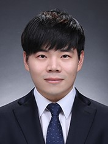

# About

## Project Manager

Name : Hyunwoo Na  

Education:

- 2010.03-2015.02 B.S in Hannam University
- 2015.03-2017.02 M.S in Energy, Environment, Water and Sustainability, Korea Advanced Institute of Science and Technology (KAIST)
- 2017.03-2021.08 Ph.D in Electrical Engineering, Korea Advanced Institute of Science and Technology (KAIST)

Vocational Experience:

- 2021.8-Present Principal Researcher, SAMSUNG SDI

Miscellaneous Experience:

- 2015.03-Present Christian, Saeronam Community Church at Daejon

Research Interest:

- First-principle Calculations
- Energy Conversion and Storage Materials
- Scientific Python
- Automation Platform
- Machine Learning

